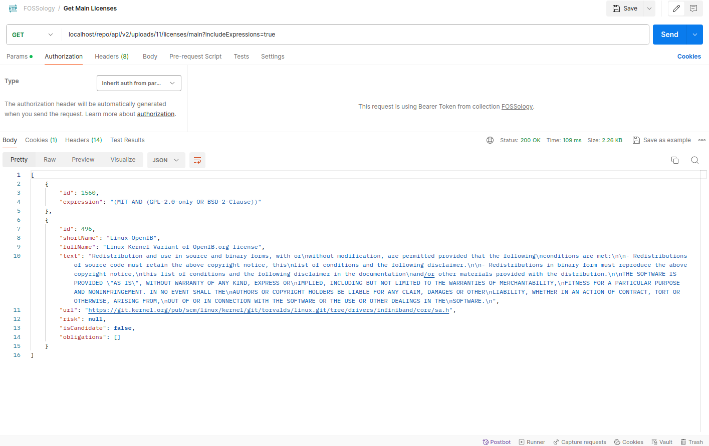
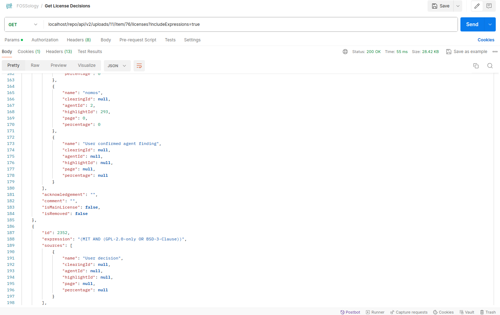
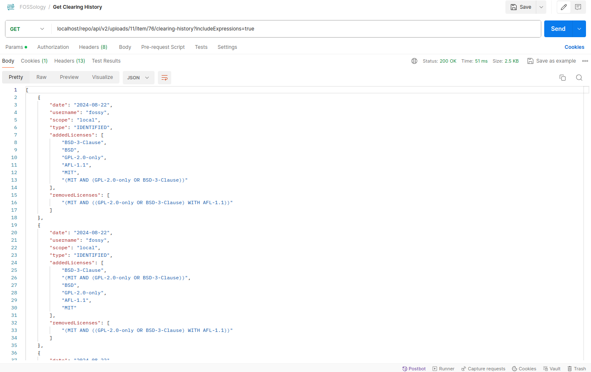
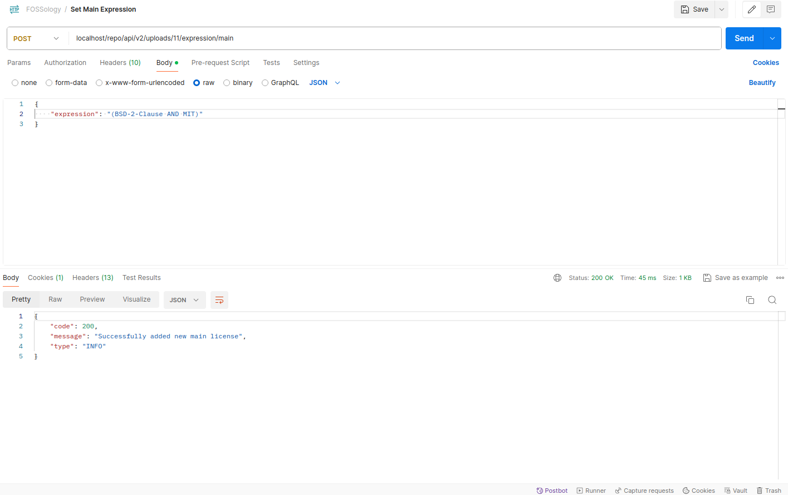
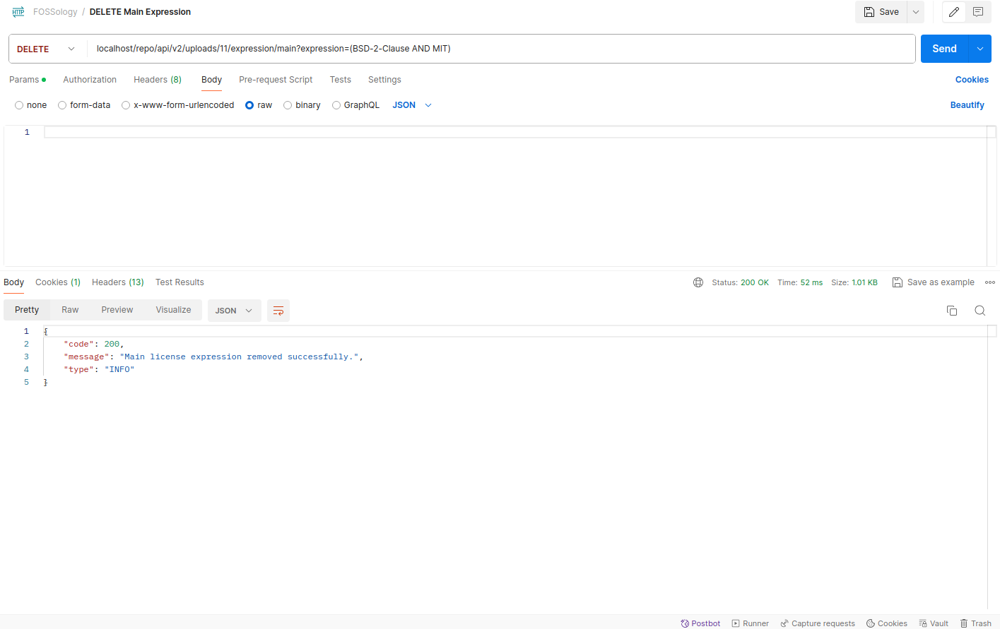
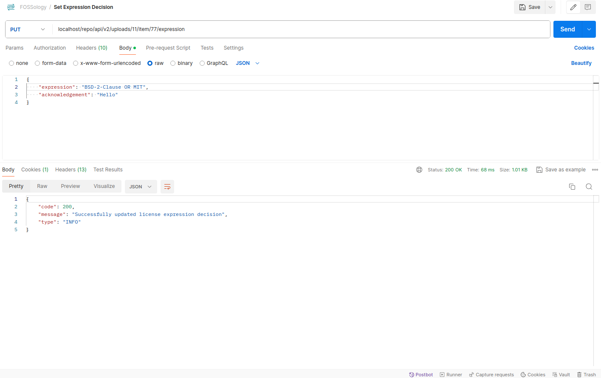

<h1 align="center">Google Summer of Code 2024 </h1>

    <h2>
        <a href="https://summerofcode.withgoogle.com/programs/2024/projects/3TCAw8EI">
            SPDX license expression support
        </a> @ 
        <a href="https://www.fossology.org/">
            FOSSology
        </a>
    </h2>

<h1 align="center" id="project-details">📝 Project Details</h1>

The goal of this project is to enhance the detection and reporting of SPDX License Expressions within FOSSology. Currently, FOSSology relies on regular expressions, full-text match, and fuzzy match to scan licenses, storing all types of license expressions as a list of licenses. This approach can lead to incorrect classifications, where conjunctive and disjunctive licenses are misclassified, and license exceptions are not distinguished from licenses.

The project focuses on several key tasks:
- Scanning license expressions using regular expressions with Ojo.
- Storing these license expressions in the database.
- Developing UI components to view and manage license expressions on the file clearing page.
- Updating reports to correctly export these expressions in the appropriate format.

<h1 align="center" id="contributions">🚀 Contributions</h1>

<h2>1. License Expression Detection</h2>

One of the primary objectives was to enhance the detection of SPDX license expressions within FOSSology. This involved modifying Ojo to detect license expressions using regular expressions.

- **Modified Ojo**: Improved Ojo's capability to detect license expressions through advanced RegEx techniques.
- **Parsing License Expressions**: Developed algorithms to parse these expressions as Abstract Syntax Trees (AST).
- **Database Integration**: Created the `license_expression` table to store these parsed expressions as AST. The schema for the `license_expression` table is outlined below.
- **Removed Dual-license Results**: Removed `Dual-license` results from Nomo and Ojo.

<h2>2. View and Edit License Expressions</h2>

This task focused on creating user-friendly UI components that allow users to view and edit license expressions directly within the FOSSology interface.

- **UI Development**: Designed and implemented intuitive UI components for the file clearing page.
- **User Interaction**: Enabled users to interact with license expressions, making it easier to understand and manage the expressions.

<h2>3. Clear License Expressions</h2>

This task involved enhancing the functionality of the FOSSology system to allow users to clear license expressions more effectively. 

- **Acknowledgements Addition**: Implemented the ability for users to add acknowledgements to license expressions.
- **Editing Capabilities**: Provided editing options for users to modify and refine license expressions.
- **Clearing History**: Users can view the edited expressions history in clearing history.
- **Custom License Expression**: Users can also add license expressions for uploads where scanners did not detect any license expressions.

<h2>4. Reporting </h2>

The project also addressed the need to accurately export license expressions in the correct format in reports. Following are the new report samples:

- [SPDX RDF](./static/SPDX2_Test%2023.zip_1724337786.spdx.rdf)
- [SPDX TagValue](./static/SPDX2TV_Test%2023.zip_1724337796.spdx)
- [SPDX CSV](./static/SPDX2CSV_Test%2023.zip_1724337755.csv)
- [CycloneDX](./static/CYCLONEDX_JSON_Test%2023.zip_2024-08-22_20_12_46.json)
- [CLIXML](./static/CLIXML_Test%2023.zip_2024-08-22_20_12_24.xml)
- [DEP5](./static/DEP5_Test%2023.zip_1724337776.txt)
- [Unified Report](./static/Test_23.zip_clearing_report_Thu_Aug_22_08_2024_08_13_26.docx)

<h2> 5. Export and Import Decisions </h2>

This task focused on extending the capabilities of FOSSology to better handle the export and import of license expression data.

- **Data Export**: Enhanced the FOSSology Dump functionality to include license expression results, ensuring that all relevant license data is captured during export operations.
- **Data Import**: Improved the import process to support license expression data from FOSSology exports, enabling seamless transfer of decisions between different instances of FOSSology.

<h2> 6. Modified Related REST APIs </h2>

This task involved updating and expanding the FOSSology REST API endpoints to support more advanced operations related to license expressions.

- **Main License Expressions**: Added the `includeExpressions` parameter to the `GET /uploads/{uploadId}/licenses/main` endpoint, allowing users to retrieve main licenses along with their associated expressions.

- **Item-Level Expressions**: Enhanced the `GET /uploads/{uploadId}/item/{itemId}/licenses` and `GET /uploads/{uploadId}/item/{itemId}/clearing-history` endpoints with optional parameters to include license expressions, providing detailed information at the item level.

- **Expression Management**:
  - Introduced the `POST /uploads/{uploadId}/expression/main` endpoint to enable users to designate license expressions as the main license for an upload.
  
  - Created the `DELETE /uploads/{uploadId}/expression/main` endpoint for removing a license expression as the main license.
  
  - Developed the `PUT /uploads/{uploadId}/item/{itemId}/expression` endpoint to set or update license expression decisions for individual items.
  

<h1 align = "center" id = "documentation">📄 Documentation</h1>

Throughout the 12 weeks of the GSoC period, I consistently created weekly documentation to track and record my progress. Week-wise documentation can be found [here](https://fossology.github.io/gsoc/docs/2024/spdx-expression).

<h1 align="center" id="deliverables">👨🏻‍🏫 Deliverables</h1>
  

| Tasks                            | Planned | Completed              |
| -------------------------------- | ------- | ----------------------- |
| License Expression Detection     |   ✅    |   ✅                    |                  |
| UI Components for Viewing & Editing |   ✅    |   ✅                    |
| Clearing License Expressions     |   ✅    |   ✅                    |
| Report Updates                   |   ✅    |   ✅                    |
| Export and Import Decisions                   |   ❌    |   ✅                    |
| REST API Changes                   |   ❌    |   ✅                    |

 
 

<h1 align="center" id="key-takeaways">📚 Key Takeaways</h1>

-   Deepened my understanding of **layered architecture** in software development, enhancing my ability to design scalable and maintainable systems.
-   Gained valuable experience working with **large and legacy codebases**, building confidence in navigating and contributing to complex projects.
-   Developed proficiency in **remote collaboration**, effectively working with a team spread across different locations.
-   Enhanced my **software design and problem-solving skills** by tackling challenging tasks and refining my approach to technical issues.
-   Mastered **time management** and consistently met project deadlines, ensuring timely and successful project deliveries.
-   Improved my ability to write **clean, maintainable code**, focusing on best practices and code quality.
-   Adapted to working with **multiple tech stacks and languages**, broadening my technical expertise and versatility.
-   Expanded my professional network and **made a lot of friends** along the way. :)

<h1 align="center" id="work-done">🎯 Links of work done</h1>
<h2 >🔗 Pull Request</h2>

- [feat(spdx-expression): License Expression Support](https://github.com/fossology/fossology/pull/2771)

<h1 align="center" id="acknowledgements">🎓 Acknowledgements</h1>

    Contributing to FOSSology during Google Summer of Code has been an immensely rewarding experience, marking my first significant foray into the world of open source. This journey has been filled with valuable lessons and unforgettable moments that I will carry with me throughout my career. While there are many individuals who have contributed to my success, I would like to extend my deepest gratitude to a few who have been pivotal in my journey.
     
     
    First and foremost, I wish to express my sincere thanks to my mentors, <a href="https://github.com/shaheemazmalmmd" target="_blank">Shaheem Azmal M MD</a> and <a href="https://github.com/GMishx" target="_blank">Gaurav Mishra</a>, for their unwavering support, insightful guidance, and constant encouragement. Their expertise, patience, and willingness to help have been instrumental in my development, both professionally and personally. I am truly grateful for the opportunity to learn from them and for the mentorship they have provided.
     
     
    I also want to extend a heartfelt thank you to my friend and colleague, <a href="https://github.com/dvjsharma" target="_blank">Divij Sharma</a>, for his constant support and motivation throughout this journey. His feedback and camaraderie have been a source of strength, and I am thankful for the positive influence he has had on my work and growth.
     
     
    Lastly, I would like to thank my family and friends for their unwavering support. Through this experience, I have had the pleasure of meeting and working alongside many incredible developers from around the world. I look forward to future collaborations and the continued friendships that have blossomed during this journey.

<h1 align = "center" id = "connections">🌐 Let's connect! </h1>

-   
-   
-   